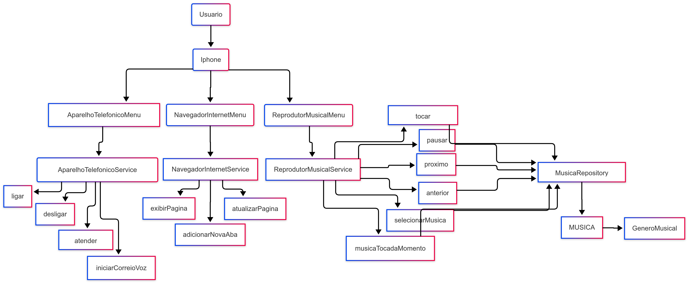

# Diagrama UML - Sistema Iphone

Este repositório contém um diagrama UML representando a estrutura e funcionalidades do sistema Iphone, incluindo os menus de telefone, navegador de internet e reprodutor musical.

## 📌 Descrição
O diagrama representa a interação entre os seguintes componentes:
- **Usuário** interage com o **Iphone**.
- O **Iphone** possui três principais menus:
  - **Aparelho Telefônico**
  - **Navegador de Internet**
  - **Reprodutor Musical**
- Cada menu possui serviços específicos, como ligar/desligar chamadas, navegar na internet e reproduzir músicas.
- O **Reprodutor Musical** se conecta ao **MusicaRepository**, que gerencia músicas e gêneros musicais.

## 📷 Diagrama UML

## 🛠 Tecnologias Utilizadas
- **Linguagem de modelagem UML**
- **Ferramentas de diagramação**: [mermaidchart](https://www.mermaidchart.com)

## 🚀 Como Usar
1. Baixe ou clone este repositório.
2. Abra o arquivo de imagem do diagrama para visualizar a estrutura do sistema.
3. Use o diagrama como referência para implementação ou documentação do projeto.

---

© 2025 - Danyel Martins Zini Silva
